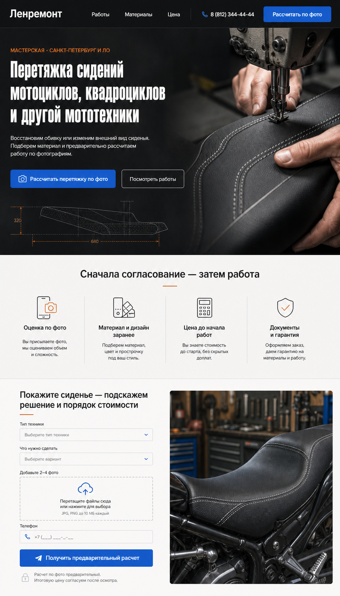

# DESIGN — «Техническое мотоателье»

Статус: утвержденное визуальное направление  
Дата фиксации: 22 июля 2026 года  
Область: лендинг «Перетяжка сидений мото, квадроциклов и другой мототехники»

Формат страницы: одностраничный лендинг без header и footer. Первый видимый блок — Hero, последний — финальный CTA. Верхняя панель на визуальном референсе не переносится в реализацию.

## 1. Источники и приоритеты

### Визуальный референс

[Открыть выбранный макет](./design-concepts/concept-1-technical-atelier.png)

Исходный растр имеет размер 948 × 1659 px и показывает desktop-композицию первых трех блоков. При реализации макет масштабируется на рабочую ширину 1440 px, а не растягивается буквально.

### Контент и стратегия

[Стратегия, SEO и полные тексты по 13 блокам](./landing-strategy.md)

### Иерархия источников

Если источники расходятся, действуют следующие приоритеты:

1. Подтвержденные данные бизнеса: цены, сроки, материалы, гарантия, адрес, логистика и контакты.
2. `landing-strategy.md`: смысл блоков, SEO, финальные тексты, CTA, микрокопирайтинг и плейсхолдеры.
3. Выбранный PNG-референс: композиция, визуальная иерархия, характер фотографий, соотношение темных и светлых поверхностей.
4. `DESIGN.md`: системная интерпретация референса — токены, компоненты, адаптив, состояния и правила расширения стилистики на всю страницу.

Текст внутри сгенерированного макета не является финальным источником копирайта. Он используется только для оценки объема и иерархии. Для верстки берутся тексты из `landing-strategy.md`.

## 2. Суть визуального направления

«Техническое мотоателье» соединяет три ощущения:

- ремесло: материал, шов, натяжение, руки мастера, промышленная машина;
- инженерная точность: схемы, размеры, слои сиденья, согласованный процесс;
- понятный сервис: один синий CTA, прозрачные этапы и удобная оценка по фото.

Страница не должна выглядеть как байкерский клуб, премиальный автосалон, мебельная мастерская или универсальный портал ремонта. Это специализированное рабочее ателье внутри надежного сервиса «Ленремонт».

### Обязательные визуальные признаки

- темный графитовый hero с реальным процессом перетяжки;
- крупный узкий заголовок с высокой плотностью;
- синий цвет используется прежде всего для действий;
- оранжевый — для технических акцентов, меток и схем;
- после темного hero идет теплая светлая поверхность;
- блок преимуществ — единая горизонтальная система с разделителями, а не набор парящих карточек;
- форма расчета встроена в страницу и сразу показывает загрузку фотографий;
- фотографии показывают сиденье, материал и работу мастера, а не просто красивый мотоцикл.

### Допустимая адаптация

- фактические пропорции hero можно менять под реальные фотографии;
- технический чертеж можно заменить схемой слоев или аккуратной контурной иллюстрацией реального сиденья;
- число пунктов преимуществ может быть 3 или 4 после подтверждения фактов;
- декоративный оранжевый акцент может быть ослаблен, если он конфликтует с действующим брендбуком.

### Нельзя переносить буквально

- изображения из AI-макета не публикуются как портфолио;
- нарисованные гарантии, документы и свойства не считаются подтвержденными фактами;
- логотип в макете не заменяет официальный логотип «Ленремонта»;
- номера телефонов и тексты из растра не копируются без сверки;
- схема сиденья не должна выглядеть как техническая документация конкретной модели, если такой документации нет.

## 3. Дизайн-принципы

1. **Показывать работу, а не атмосферу вокруг нее.** Главный предмет каждого кадра — сиденье, материал, шов или операция.
2. **Один экран — одна мысль.** Не смешивать цену, гарантии, материалы и кейсы в одной перегруженной секции.
3. **Сначала доказательство, затем обещание.** Сильные утверждения соседствуют с фотографией, документом, образцом или кейсом.
4. **Синий означает действие.** Не окрашивать синим большие декоративные поверхности без функциональной причины.
5. **Оранжевый означает техническую деталь.** Использовать для размеров, линий, маленьких иконок и надзаголовков.
6. **Минимум декоративных контейнеров.** Разделять контент сеткой, интервалами, линиями и фоном; тени — только для выпадающих слоев.
7. **Реалистичная плотность.** Интерфейс выглядит собранным и профессиональным, но не тесным.

## 4. Токен-архитектура

Используется трехуровневая система: `primitive → semantic → component`. В компонентах запрещены случайные hex-значения, радиусы и отступы.

### 4.1. Primitive tokens

Цвета ниже извлечены и нормализованы по выбранному референсу. Перед продакшеном синий и официальный логотип нужно сверить с брендбуком «Ленремонта».

| Токен | Значение | Назначение |
|---|---:|---|
| `--ink-950` | `#101214` | hero, самые темные секции |
| `--ink-900` | `#181B1B` | вторичная темная поверхность |
| `--ink-800` | `#262A2D` | границы и hover на темном фоне |
| `--stone-50` | `#F5F3F2` | основной теплый светлый фон |
| `--stone-100` | `#EEECE8` | подложки и альтернативные светлые зоны |
| `--stone-300` | `#D8D5CF` | светлые границы и разделители |
| `--white` | `#FFFFFF` | текст на темном, поля и поверхности |
| `--blue-600` | `#2769CA` | основной CTA; взят из референса |
| `--blue-700` | `#1F5DB8` | hover CTA |
| `--blue-800` | `#194B94` | active CTA |
| `--orange-600` | `#E56B2F` | технический акцент |
| `--orange-700` | `#C95A1E` | hover/усиленный акцент |
| `--gray-600` | `#656B73` | вторичный текст на светлом фоне |
| `--gray-300` | `#C8CDD1` | вторичный текст на темном фоне |
| `--red-600` | `#C83E3E` | ошибки формы |
| `--green-600` | `#27855B` | успешная отправка |

### 4.2. Semantic tokens

| Токен | Ссылка |
|---|---|
| `--color-page` | `var(--stone-50)` |
| `--color-surface` | `var(--white)` |
| `--color-surface-subtle` | `var(--stone-100)` |
| `--color-surface-dark` | `var(--ink-950)` |
| `--color-text` | `var(--ink-900)` |
| `--color-text-muted` | `var(--gray-600)` |
| `--color-text-on-dark` | `var(--white)` |
| `--color-text-muted-on-dark` | `var(--gray-300)` |
| `--color-primary` | `var(--blue-600)` |
| `--color-primary-hover` | `var(--blue-700)` |
| `--color-primary-active` | `var(--blue-800)` |
| `--color-accent` | `var(--orange-600)` |
| `--color-border` | `var(--stone-300)` |
| `--color-border-dark` | `var(--ink-800)` |
| `--color-focus` | `var(--blue-600)` |

### 4.3. Spacing, radius, shadow

Базовая единица — 4 px.

| Группа | Значения |
|---|---|
| Отступы | `4, 8, 12, 16, 20, 24, 32, 40, 48, 64, 80, 96, 120 px` |
| Радиусы | `4 px` мелкие элементы, `8 px` поля/кнопки, `12 px` крупные фото и формы, `999 px` только теги |
| Тени | отсутствуют в обычных секциях; `0 12px 36px rgb(0 0 0 / 16%)` только popup/dropdown |
| Разделители | `1 px` solid semantic border |

Референс визуально более строгий, чем типичный SaaS-интерфейс. Радиусы 20–32 px и мягкие цветные тени нарушают направление.

### 4.4. Breakpoints и контейнер

| Токен | Значение |
|---|---:|
| `--bp-sm` | `480 px` |
| `--bp-md` | `768 px` |
| `--bp-lg` | `1024 px` |
| `--bp-xl` | `1280 px` |
| `--container-max` | `1200 px` |
| Боковое поле desktop | `24 px`, после 1248 px — автоматически |
| Боковое поле mobile | `16 px` |

## 5. Типографика

### Шрифтовая пара

- Display/H1: `Oswald`, 700. Он передает плотный технический характер референса и поддерживает кириллицу.
- Интерфейс и основной текст: `Golos Text`, 400/500/600/700.
- Если у бренда есть лицензированный узкий шрифт, его можно поставить вместо `Oswald` после визуального сравнения.

Шрифты должны быть self-hosted в WOFF2. Не загружать все начертания: достаточно `Oswald 700` и `Golos Text 400/500/600/700`.

### Шкала

| Стиль | Desktop | Mobile | Правила |
|---|---|---|---|
| H1 | `clamp(56px, 5.4vw, 78px)` / `0.98` | `42–48 px` / `1.02` | `Oswald 700`, без искусственного uppercase |
| H2 | `42–48 px` / `1.08` | `32–36 px` / `1.12` | `Golos Text 700` либо `Oswald 700` для коротких секций |
| H3 | `22–26 px` / `1.2` | `20–22 px` | `Golos Text 600–700` |
| Lead | `18–20 px` / `1.5` | `17–18 px` | ширина строки до 54 знаков |
| Body | `16–18 px` / `1.55` | `16 px` | ширина строки до 65 знаков |
| Label | `14 px` / `1.3` | `14 px` | `500–600` |
| Eyebrow | `13–14 px` | `12–13 px` | uppercase, `700`, tracking `0.08em`, orange |
| Caption | `12–14 px` | `12–13 px` | muted |

Техническая подача создается контрастом размеров, а не постоянным использованием капса. Капс разрешен для eyebrow, коротких меток и размеров.

## 6. Сетка и ритм страницы

- Основная сетка: 12 колонок, gap 24 px desktop / 16 px tablet.
- Hero: текст 5 колонок, фотография 7 колонок с выходом к правому краю viewport.
- Светлые секции: содержимое в контейнере 1200 px.
- Вертикальный интервал между крупными секциями: 96–120 px desktop, 64–80 px tablet, 48–64 px mobile.
- Интервал «eyebrow → H2»: 12–16 px.
- Интервал «H2 → lead»: 20–24 px.
- Интервал «текст → действие»: 32–40 px.

Страница должна чередовать плотные темные доказательные зоны и спокойные светлые зоны. Нельзя делать каждый блок отдельной карточкой на сером фоне.

## 7. Первые три блока — эталонная спецификация

### 7.1. Hero

**Контент:** блок 1 из `landing-strategy.md`.

**Desktop:**

- минимальная высота 630–700 px;
- фон `--color-surface-dark`;
- левая текстовая зона — 5/12 колонок, вертикальное выравнивание по центру;
- правая фотография — 7/12 колонок, занимает всю высоту hero;
- в переходе между текстом и фото допускается темный градиент только для читаемости;
- H1 занимает не более 4 строк при ширине 1440 px;
- CTA-группа: primary blue + secondary outline;
- между лидом и CTA — три коротких преимущества вертикальным списком: стоимость до начала работ, гарантия 1 год, доставка в мастерскую и обратно;
- маркер преимущества — компактная оранжевая техническая засечка или line-icon 18–20 px; не использовать крупные зеленые галочки;
- текст преимущества — `Golos Text` 15–16 px, medium, одна строка на desktop; интервал между пунктами 10–12 px;
- внизу слева — тонкая контурная схема сиденья с 1–2 оранжевыми размерами;
- hero-фото не закрывается текстом более чем на 15–20%.

**Hero-фотография:** крупный план работы промышленной швейной машины или рук мастера с реальным сиденьем. Видны фактура, ровная строчка и инструмент. Не использовать крупный общий план мотоцикла.

**Mobile:**

- текст идет первым;
- H1 — максимум 5 строк;
- primary CTA на всю ширину, secondary — текстовая/outline кнопка ниже;
- преимущества идут одним столбцом перед CTA; длинный пункт допускает перенос максимум на две строки;
- фото 4:3 или 5:4 после CTA;
- техническая схема упрощается или скрывается, если мешает главному действию.

### 7.2. Блок быстрых доказательств

**Контент:** блок 2 из `landing-strategy.md`.

- светлый фон `--color-page`;
- центрированный H2;
- короткая оранжевая линия 40–48 px под заголовком;
- четыре преимущества в одной строке;
- между пунктами вертикальные разделители;
- иконки line 32–40 px, толщина 1.75–2 px;
- заголовок пункта 18–20 px, описание 14–16 px;
- никаких внешних рамок и теней.

Если гарантия или документы не подтверждены, соответствующий пункт заменяется подтвержденным процессом. Визуальная симметрия не является основанием публиковать неподтвержденное обещание.

**Mobile:** сетка 2 × 2; разделители перестраиваются; на ширине до 380 px — один столбец.

### 7.3. Форма предварительного расчета

**Контент:** блок 3 из `landing-strategy.md`.

- светлый фон;
- 5/12 колонок — форма, 7/12 — реальная фотография готового сиденья в мастерской;
- форма не помещается в дополнительную «карточку»; ее границы задаются сеткой и полями;
- поля высотой 52 px, textarea минимум 112 px;
- upload-зона минимум 160 px, dashed border, понятные состояния;
- primary button 56 px, на всю ширину формы;
- пояснение о предварительном характере расчета располагается непосредственно под кнопкой;
- фотография справа имеет радиус 12 px и единый crop, без декоративной рамки.

**Обязательные состояния upload:** empty, drag-over, uploading, preview, invalid type, too large, retry, remove. Загрузка доступна клавиатурой и экранному диктору.

**Mobile:** сначала форма, затем фотография; фотографию можно сократить до 3:2. Поля и кнопка на всю ширину. Нативный вызов камеры должен быть доступен через `accept="image/*"` и `capture` как progressive enhancement, а не как единственный способ выбора файла.

## 8. Компоненты

### 8.1. Button

| Вариант | Default | Hover | Active | Focus | Disabled |
|---|---|---|---|---|---|
| Primary | blue-600 / white | blue-700 | blue-800 | 2 px blue ring + 2 px offset | stone-300 / gray-600, 60% |
| Outline dark | transparent / white / gray border | ink-800 | ink-900 | white/blue ring | 45% opacity |
| Text/link | transparent / current | underline/arrow shift 2 px | no transform | visible outline | 45% opacity |

Desktop CTA: 52–56 px; mobile CTA: не менее 48 px. Радиус 8 px. Motion 150–200 ms. Не использовать bounce и сильное масштабирование.

### 8.2. Form controls

- label всегда видим над полем;
- placeholder не заменяет label;
- default border `--color-border`;
- hover — более темная граница;
- focus — border primary + 2 px ring с достаточным контрастом;
- error — красная граница, иконка и текст ошибки;
- success не окрашивает все поле в зеленый;
- disabled используется только при реальной недоступности.

### 8.3. Proof item

Состав: иконка → короткий заголовок → одна поясняющая фраза. Пункт не кликабельный, если не ведет к конкретному доказательству. Без фона и тени.

### 8.4. Case card

- фото 3:2 или честная пара до/после;
- видимая подпись: модель, задача, выполненные работы;
- срок и стоимость публикуются только при подтверждении;
- hover не скрывает важный текст;
- карточка не имеет сильной тени; отделение — граница или фон.

### 8.5. Material swatch

- реальная макрофотография материала;
- название коллекции/артикул при наличии;
- 2–3 подтвержденных свойства;
- сфера применения;
- цвет на экране сопровождается предупреждением о необходимости физического образца.

### 8.6. Price row

Не использовать «тарифные карточки» SaaS-типа. Цена отображается строками: услуга → что входит → «от» → примечание о материале. На mobile строки становятся вертикальными блоками с разделителями.

### 8.7. FAQ

- нативная семантика button/region либо корректный accordion;
- `aria-expanded`, видимый focus;
- один вопрос может быть раскрыт по умолчанию;
- анимация высоты не должна ломать reduced motion.

### 8.8. Mobile sticky CTA

Два действия: «Фото» и «Позвонить». Высота 64–72 px плюс safe-area. Не показывать одновременно с раскрытым modal/upload. Не перекрывать cookie banner и сообщения формы.

## 9. Распространение стилистики на блоки 4–13

| Блок из стратегии | Поверхность | Визуальный прием |
|---|---|---|
| 4. Типы техники | light | реальные фото-категории, сетка 3/2/1, короткие подписи |
| 5. Галерея до/после | dark | крупные пары изображений, белые подписи, orange case metadata |
| 6. Варианты работ | light | схема слоев + группы «восстановить / изменить / оформить» |
| 7. Материалы | stone/light | макросъемка, линейная сравнительная сетка без псевдонаучных рейтингов |
| 8. Стоимость | white | строгие price rows, один blue CTA |
| 9. Процесс | dark | 5 этапов на технической линии, реальные фото операций |
| 10. Логистика и документы | light | два сценария передачи + фактическая информация |
| 11. Гарантия и контроль | light/stone | короткий текст, контрольный список, ссылка на условия |
| 12. FAQ | white | широкий accordion, без декоративных карточек |
| 13. Финальный CTA | dark | сильный готовый проект, тот же CTA «Рассчитать перетяжку по фото» |

Темный фон используется как смысловой акцент, а не через одну секцию автоматически.

## 10. Фотостиль и ассеты

### Обязательный набор

- hero: процесс шитья/натяжки, горизонтальный исходник минимум 2400 px;
- форма: готовое сиденье в мастерской, вертикальный или квадратный исходник;
- минимум 6 проектов, из них 3 пары до/после;
- 4–6 макро материалов;
- схема слоев сиденья, основанная на реальной конструкции;
- фото точки приема/мастера/процесса;
- официальный логотип в SVG/PNG из бренд-источника.

### Арт-дирекшн

- свет направленный, нейтрально-теплый;
- фон мастерской слегка размыт, но остается правдоподобным;
- черный материал не проваливается в сплошное пятно;
- шов и фактура читаются;
- руки чистые, без постановочной «рекламной» драматизации;
- единая цветокоррекция: нейтральный графит, умеренно теплые оттенки кожи, без teal-orange эффекта.

### Запрещено

- стоковый мотоцикл вместо результата работы;
- огонь, дым, черепа, клетчатый флаг, псевдометалл;
- фотографии мебели или автомобильных салонов в первых экранах;
- AI-изображения, выдаваемые за реальные кейсы;
- изображения чужих работ без прав;
- растянутые изображения и разные цветовые профили в одной галерее.

## 11. Иконки и техническая графика

- использовать одну библиотеку outline-иконок либо единый авторский набор;
- базовый размер 24 px, в proof-блоке 36 px;
- stroke 1.75–2 px;
- иконка поддерживает текст, но не заменяет его;
- технические схемы — тонкие линии `1–1.5 px`, белые/серые на dark, orange только для размеров и указателей;
- не использовать emoji и случайные разнохарактерные pictogram.

## 12. Motion

| Событие | Длительность | Поведение |
|---|---:|---|
| Hover/focus controls | 150 ms | color/border only |
| Button press | 120 ms | translateY 1 px, без scale |
| Accordion | 200–240 ms | height/opacity |
| Section reveal | 280–360 ms | opacity + translateY 12 px, один раз |
| Upload progress | по факту | progress indicator + text status |

Запрещены бесконечные анимации, тяжелый parallax, автопрокрутка кейсов и видео со звуком. При `prefers-reduced-motion` остаются только мгновенные изменения состояний.

## 13. Доступность

- WCAG AA: обычный текст 4.5:1, крупный 3:1, элементы интерфейса 3:1;
- видимый `:focus-visible` на каждом интерактивном элементе;
- минимальная зона нажатия 44 × 44 px;
- логичный heading outline: один H1, далее H2/H3;
- alt описывает конкретный кадр, а не перечисляет ключевые слова;
- ошибки формы связываются с полями через `aria-describedby`;
- success/error объявляются через live region;
- upload и галерея доступны без drag и hover;
- декоративные схемы скрываются от screen reader;
- фоновые изображения не содержат единственный экземпляр важного текста.

## 14. Контентные правила

- финальные тексты берутся из блока 6 `landing-strategy.md`;
- основной CTA везде: «Рассчитать перетяжку по фото»;
- вторичный путь: звонок или просмотр работ;
- слово «точный» не использовать для расчета только по фото;
- цены, сроки, гарантии, материалы и перечень техники не публикуются из макета;
- плейсхолдеры `[НУЖНО ПОДТВЕРДИТЬ]` не должны попасть в production;
- не повторять exact-keyword в каждом заголовке;
- технические детали объясняют выгоду, а не демонстрируют компетентность ради терминов;
- исключить агрессивные акции, ложный дефицит и критику конкурентов.

## 15. Performance и SEO, влияющие на дизайн

- сохранить текущий URL либо сделать 301 при согласованной миграции;
- hero-изображение responsive: AVIF/WebP, правильный `srcset`, preload только LCP-варианта;
- изображения ниже первого экрана — lazy load;
- резервировать размеры всех медиа для исключения CLS;
- не прятать SEO-текст в табах, которые не рендерятся сервером;
- форма и контент должны работать без тяжелого SPA-runtime;
- один H1, metadata и schema берутся из SEO-раздела `landing-strategy.md`;
- FAQ markup соответствует видимым вопросам и ответам;
- сторонние чаты и виджеты не перекрывают mobile CTA.

Целевые web-vitals после запуска: LCP ≤ 2.5 s, CLS ≤ 0.1, INP ≤ 200 ms на p75. Это критерии проверки, а не обещание до измерения.

## 16. Критерии визуальной приемки

Реализация соответствует направлению, если:

- hero узнаваемо повторяет композицию утвержденного референса;
- H1 плотный, узкий и занимает доминирующее место;
- процесс перетяжки является главным hero-изображением;
- primary CTA синий и визуально один на каждом экране;
- orange занимает менее 10% цветовой площади и работает как акцент;
- первые три блока сохраняют порядок `hero → доказательства → оценка по фото`;
- proof-блок не превращен в четыре shadow-card;
- форма выглядит частью страницы, а не popup/квизом;
- light/dark поверхности и интервалы дают тот же ритм, что референс;
- desktop 1440 и mobile 390 визуально проверены;
- нет неподтвержденных фактов и чужих/стоковых доказательств.
